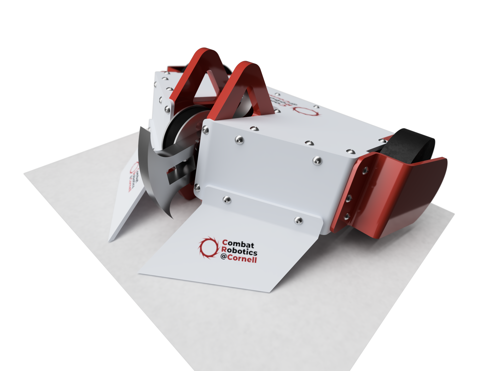

Note: This site is a work in progress - some internal links are currently broken.

<!-- Card with cards at right -->

	<!-- one card at left -->
	

		

			<!-- Image Card with Isaac's Picture -->
			
			

				<h4 class="card-title">Isaac Newcomb</h4>
				<h5 class="card-text">Mechanical Engineer / Musician / 3D Printing Enthusiast</h5>
				
I design things that improve life for humans.

				<a href="bio" class="btn btn-primary">More about me</a>
			

		

		 
		<!-- Contact-info buttons in a group -->
		

			<a href="mailto:isaacdnew@gmail.com" class="btn btn-secondary">Email</a>
			<a href="tel:1-518-418-5518" class="btn btn-secondary">Phone</a>
			<a href="https://www.linkedin.com/in/isaacdnew" class="btn btn-secondary">LinkedIn</a>
			<a href="https://soundcloud.com/isaacnewcomb/" class="btn btn-secondary">SoundCloud</a>
		

	

	<!-- Group of cards at right -->
	

		

			

				

					
					

						<h4 class="card-title">Frog</h4>
						
A reclaimed metal frog sculpture built in a week

						<a href="bio" class="btn btn-primary">See project</a>
					

				

			

			

				

					
					

						<h4 class="card-title">Reuleaux Machine L6</h4>
						
CAD model of machine L6 in Cornell's Reuleaux collection

						<a href="bio" class="btn btn-primary">See project</a>
					

				

			

		

		

			

				

					
					

						<h4 class="card-title">3-Lb Combat Robot</h4>
						
A vertical spinner design made over the summer with Combat Robotics at Cornell

						<a href="bio" class="btn btn-primary">See project</a>
					

				

			

			

				

					
					

						<h4 class="card-title">Isaac Newcomb</h4>
						
I design things that improve life for humans.

						<a href="bio" class="btn btn-primary">See project</a>
					

				

			

		

	

## Projects

- [Ice Keys](projects/ice-keys/ice-keys.md) (a new musical instrument)
- [Covid-19 Face Shields](projects/covid-shields/covid-shields.md)
- [Reclaimed Metal Frog](projects/frog/frog.md)
- [Expressio](projects/expressio/expressio.md) (a manual smile to put over your mask)